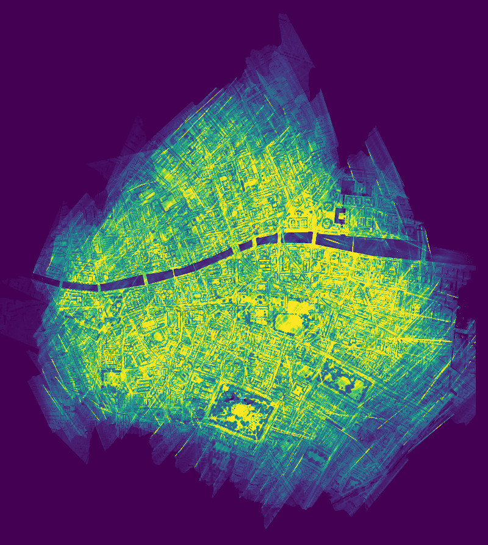
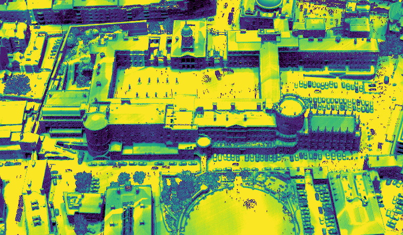
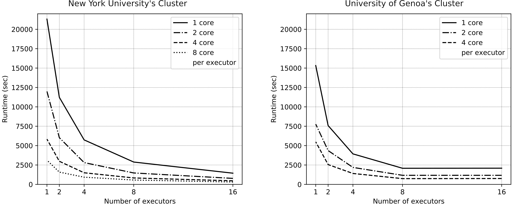

## Spark LPD

*Parallel computation of point clouds' local point density index using Apache Spark*

Details of the underlying algorithm are available in [this paper](https://doi.org/10.5194/isprs-annals-VIII-4-W2-2021-75-2021).

This algorithm is meant to be a more scalable alternative to CloudCompare's [solution](https://www.cloudcompare.org/doc/wiki/index.php?title=Compute_geometric_features) to local point feature computation. The higher scalability comes from two sources:

* The algorithm can handle data out of core.
* Depending on the deployment environment, the algorithm can make use of multiple cores of a shared-memory computer or multiple nodes and cores of a distributed-memory computer cluster for parallel computing.

At the moment, the software supports LPD as the only feature. Implementation of other feaures is in progress.

### Compile

Maven
```bash
mvn clean package
```

### Run (cluster mode)

```bash
spark-submit \
  --class umg.localfeatures.exec.ComputeDensity \
   --master yarn \
   --deploy-mode cluster \
   --num-executors <executors> \
   --executor-cores <cores> \
   --driver-memory <driver_mem> \
   --executor-memory <executor_mem> \
  --conf spark.hadoop.mapreduce.fileoutputcommitter.algorithm.version=2 \
  --conf spark.serializer=org.apache.spark.serializer.KryoSerializer \
  target/local-features-0.1-SNAPSHOT-jar-with-dependencies \
  -i <in_pcloud> -p <num_splits> \
  -o <out_pcloud> \
  -tile_size <tile_size> \
  -offset <offset> \
  -radius <radius> \
  -rtree_params <rtrre_params> \
  -local_voxel_size <voxel_size>
```

| Parameter | Description | Example |
|--|--|--|
| executors | num. executors | 4 |
| cores | num. cores per executor  | 4 |
| driver_mem | driver's memory  | 1g  |
| executor_memory | executor's memory | 4g |
| in_pcloud | path to input point cloud  | pcloud/d15 |
| num_splits | number of splits to partition the input files (optional) | 4 | 
| out_pcloud | path to output point cloud  | pcloud/d15_lpd |
| tile_size | tile size  | 5 5 |
| offset | coordinate offset applied to input point cloud prior to processing | 316000 234000 |
| radius | radius of the local spherical neighbourhood | 0.5 |
| rtree_params | R-tree parameters | 0 16 star |
| local_voxel_size | local voxel size for per tile LPD computation | 0.25 0.25 0.25 |

### Example LPD results 

Density heat map of the 1.4 billion point [LiDAR point cloud of Dublin](https://geo.nyu.edu/catalog/nyu-2451-38684). Computing this map took just over 5 minutes with 16 parallel executors * 8 cores/executor.




Close-up view of the result.



#### Computational performance 

This graph shows how the computation scaled out to multiple parallel processors. [This paper](https://doi.org/10.5194/isprs-annals-VIII-4-W2-2021-75-2021) explains the details.



### Contact

Anh Vu Vo at voanhvuxd@gmail.com 

### License

Copyright 2021 Anh Vu Vo
   
   Licensed under the Apache License, Version 2.0 (the "License");
   you may not use this file except in compliance with the License.
   You may obtain a copy of the License at

       http://www.apache.org/licenses/LICENSE-2.0

   Unless required by applicable law or agreed to in writing, software
   distributed under the License is distributed on an "AS IS" BASIS,
   WITHOUT WARRANTIES OR CONDITIONS OF ANY KIND, either express or implied.
   See the License for the specific language governing permissions and
   limitations under the License.